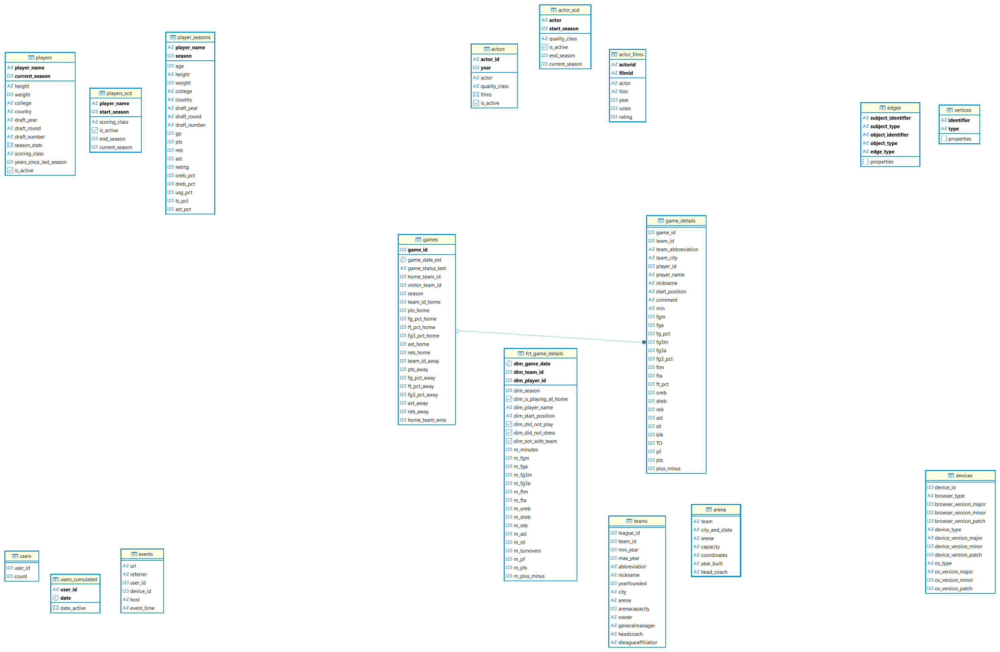

# 📈 Advanced PostgreSQL Data Modeling & Analytics

This project implements advanced SQL techniques in PostgreSQL to solve complex Data Engineering challenges, focusing on historical data management, performance optimization, and sophisticated data structure modeling.

## ⚙️ Key Technical Highlights

The repository showcases solutions for handling data that goes beyond basic relational joins:

| Technique | Problem Solved | Implementation Detail |
| :--- | :--- | :--- |
| **SCD Type 2 (Functional)** | Tracking historical changes (e.g., actor quality, player activity status) without complex `UPDATE` statements. | Utilized **PostgreSQL Window Functions** (`LAG`, `SUM() OVER`) to generate **"Streak Identifiers"**, efficiently defining `start_season` and `end_season` for each historical record. |
| **Bitmasking for User Activity** | Optimizing storage and performance for calculating **Daily/Monthly Active Users (DAU/MAU)**. | Compressed 32 days of user activity into a single 32-bit integer (`BIT(32)`), allowing for rapid and memory-efficient calculation of user retention metrics. |
| **Graph Modeling in RDBMS** | Analyzing complex relationships (e.g., player collaborations, game relationships) typically requiring a Graph Database. | Converted relational NBA data into **Vertices** and **Edges** using **PostgreSQL's JSON and Custom ENUM Types** to store properties and define relationship types. |
| **Complex Array Types** | Minimizing expensive joins between Dimension and Fact tables. | Used **`ARRAY` of `COMPOSITE TYPE`** (custom row types) to embed multi-year statistics (e.g., `season_stats`) directly within the `players` table, optimizing for read-heavy OLAP workloads. |

## 🏗 Data Architecture & Modeling

The database is architected to handle distinct data engineering challenges, organized into four logical domains:



1.  **Analytical Layer (Center):** * Designed a **Star Schema** centered around `fct_game_details` to enable high-performance aggregation of NBA game statistics.
    * Connected with Dimension tables like `teams`, `games`, and `arena`.

2.  **Historical Tracking / SCD Type 2 (Top-Left):** * Implemented strict **Slowly Changing Dimensions Type 2** for `players_scd` and `actor_scd` tables.
    * Captures historical changes (e.g., `is_active`, `scoring_class`) with `start_season` and `end_season` validity columns.

3.  **Graph Modeling (Top-Right):** * Modeled complex relationships using a graph schema (`vertices` & `edges`) to analyze networks like "Player A plays against Player B".

4.  **Storage Optimization (Bottom-Left):** * Utilized **Bitmasking** in the `users_cumulated` table to compress 30 days of user activity into a single integer, drastically reducing storage costs compared to raw event logs.

## 📁 Repository Structure

The project is structured to separate data definition (Schema) from transformation logic (ETL/ELT):

```text
advanced-postgresql-data-modeling/
├── DDL/                                 # Data Definition Language (Schema)
│   ├── 01_create_types.sql              # All CREATE TYPE statements
│   └── 02_create_tables.sql             # All CREATE TABLE statements
├── Transformation_Logic/                # Data Transformation Logic (DML)
│   ├── 01_player_season_cumulation.sql  # Player stats aggregation
│   ├── 02_actor_scd_implementation.sql  # SCD Type 2 for actors
│   ├── 03_graph_modeling_nba.sql        # Vertices and Edges creation
│   └── 05_user_activity_bitmask.sql     # Bitmasking implementation for user activity
└── README.md
```

## 💻 Tech Stack

  * **Database:** PostgreSQL
  * **Key Concepts:** Dimensional Modeling, Slowly Changing Dimensions (SCD), Bitwise Operations, Window Functions, Data Integrity.
  * **Tools:** DBeaver, Git.
